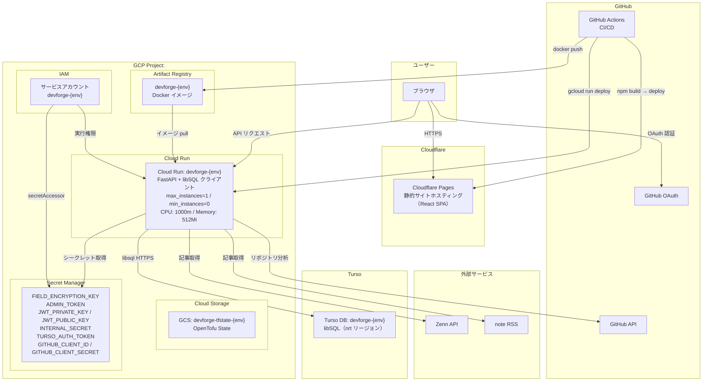

# DevForge

キャリア関連ドキュメント（職務経歴書）の作成・管理。
GitHub活動分析、ブログ連携による発信力を集計
キャリアインテリジェンスを提供するWebアプリケーションです。

## ドキュメント

| ドキュメント | 内容 |
|---|---|
| [docs/development.md](./docs/development.md) | Nix devshell・初回セットアップ・ローカル開発・テスト/リント |
| [docs/deployment.md](./docs/deployment.md) | 本番デプロイ（GCP）・OpenTofu インフラ構成・CI/CD・ブランチ保護 |
| [docs/api.md](./docs/api.md) | REST API 一覧・環境変数リファレンス |
| [docs/data-model.md](./docs/data-model.md) | Turso (libSQL) 運用・Alembic マイグレーション・データ設計 |
| [docs/adr/](./docs/adr/) | アーキテクチャ判断記録（ADR） |
| [docs/runbooks/](./docs/runbooks/) | 運用 Runbook |

## 主な機能

### ドキュメント管理
- **基本情報**: 氏名・記載日・資格の管理
- **職務経歴書**: 職務要約、自己PR、職務経歴、技術スタックの入力とPDF/Markdown出力
- フォーム入力状態を Redux でページ遷移間に保持（入力途中で別ページに移動しても失われない）

### GitHub分析
- GitHub OAuthログインしたユーザーのリポジトリ・コミット履歴を自動分析
- スキル抽出・タイムライン可視化・成長分析・キャリア予測
- **ポジションアドバイス**: 分析結果をもとに、現在のスキルセットに対するポジション別の学習アドバイスをAIが生成
- 分析はバックグラウンド非同期処理（202 Accepted → ステータスポーリング方式）

### ブログ連携
- **Zenn** / **note** のアカウント連携・記事同期
- 記事メトリクス（タイトル、URL、公開日、いいね数、タグ）の一覧管理
- **ブログスコアリング**: 投稿頻度・反応数・技術記事比率等をもとにスコアを算出
- AIによるブログ活動要約（バックグラウンド非同期、ステータスポーリング方式）

### AIキャリアパス分析
- 職務経歴書データをもとに、LLMが希望ポジションへのキャリアパスを生成
- 分析履歴を複数バージョン保持・管理
- バックグラウンド非同期処理（202 Accepted → ステータスポーリング方式）

### 通知
- GitHub分析・ブログ要約・キャリア分析などのバックグラウンドタスクの成功/失敗をサイドバーの通知ベルで通知
- 未読バッジ表示（30秒ポーリング）・ドロップダウンパネルで一覧表示
- 「全て既読」ボタン・パネル外クリックで閉じる

## 技術スタック

| レイヤー | 技術 |
|---|---|
| フロントエンド | React 18, TypeScript, Vite, Redux Toolkit, Recharts, marked |
| バックエンドAPI | Python 3.13, FastAPI, SQLAlchemy, Pydantic |
| データベース | Turso (libSQL / SQLite 互換、`sqlalchemy-libsql`) |
| 認証 | JWT Cookie (python-jose), bcrypt, GitHub OAuth |
| 暗号化 | Fernet（フィールド暗号化）, bcrypt（パスワード） |
| PDF出力 | WeasyPrint（職務経歴書）, ReportLab（分析レポート補助） |
| LLM | Ollama / Vertex AI（設定で切替、任意） |
| インフラ | GCP (Cloud Run, Artifact Registry, Secret Manager), Turso, Cloudflare Pages |
| IaC | OpenTofu（モジュール構成、マルチ環境） |
| CI/CD | GitHub Actions |

## クイックスタート

詳細手順は [docs/development.md](./docs/development.md) を参照。

```bash
nix develop          # devshell に入る（direnv 利用時は自動）
make setup           # git hooks + backend (.venv + uv) + frontend (npm ci)
make generate-keys   # JWT RS256 鍵ペアを生成
cp backend/.env.example backend/.env

make dev             # docker compose up（FastAPI + Ollama + Redis + libSQL）
```

CI 相当を一括で走らせる:

```bash
make ci              # lint + test + build-frontend
```

## システム構成図


