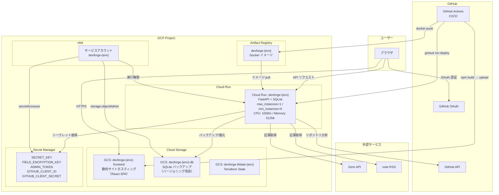

# DevForge

キャリア関連ドキュメント（職務経歴書・履歴書）の作成・管理。
GitHub活動分析、ブログ連携による発信力を集計
キャリアインテリジェンスを提供するWebアプリケーションです。

## 主な機能

### ドキュメント管理
- **基本情報**: 氏名・記載日・資格の管理
- **職務経歴書**: 職務要約、自己PR、職務経歴、技術スタックの入力とPDF/Markdown出力
- **履歴書**: 学歴・職歴・志望動機・証明写真等の入力とPDF/Markdown出力（個人情報フィールドは暗号化保存）
- フォーム入力状態を Redux でページ遷移間に保持（入力途中で別ページに移動しても失われない）

### GitHub分析
- GitHub OAuthログインしたユーザーのリポジトリ・コミット履歴を自動分析
- スキル抽出・タイムライン可視化・成長分析・キャリア予測
- **ポジションアドバイス**: 分析結果をもとに、現在のスキルセットに対するポジション別の学習アドバイスをAIが生成
- 分析はバックグラウンド非同期処理（202 Accepted → ステータスポーリング方式）

### ブログ連携
- **Zenn** / **note** のアカウント連携・記事同期
- 記事メトリクス（タイトル、URL、公開日、いいね数、タグ）の一覧管理
- **ブログスコアリング**: 投稿頻度・反応数・技術記事比率等をもとにスコアを算出
- AIによるブログ活動要約（バックグラウンド非同期、ステータスポーリング方式）

### AIキャリアパス分析
- 職務経歴書データをもとに、LLMが希望ポジションへのキャリアパスを生成
- 分析履歴を複数バージョン保持・管理
- バックグラウンド非同期処理（202 Accepted → ステータスポーリング方式）

### 通知
- GitHub分析・ブログ要約・キャリア分析などのバックグラウンドタスクの成功/失敗をサイドバーの通知ベルで通知
- 未読バッジ表示（30秒ポーリング）・ドロップダウンパネルで一覧表示
- 「全て既読」ボタン・パネル外クリックで閉じる

## 技術スタック

| レイヤー | 技術 |
|---|---|
| フロントエンド | React 18, TypeScript, Vite, Redux Toolkit, Recharts, marked |
| バックエンドAPI | Python 3.13, FastAPI, SQLAlchemy, Pydantic |
| データベース | SQLite（GCSバックアップ） |
| 認証 | JWT Cookie (python-jose), bcrypt, GitHub OAuth |
| 暗号化 | Fernet（フィールド暗号化）, bcrypt（パスワード） |
| PDF出力 | WeasyPrint（職務経歴書/履歴書）, ReportLab（分析レポート補助） |
| LLM | Ollama / Vertex AI（設定で切替、任意） |
| インフラ | GCP (Cloud Run, GCS, Artifact Registry, Secret Manager) |
| IaC | Terraform（モジュール構成、マルチ環境） |
| CI/CD | GitHub Actions |

## セットアップ

### Nix を使ったセットアップ（推奨）

[Nix](https://nixos.org/download/) がインストール済みの場合、`nix develop` 一発で Python 3.13・Node.js 22・Redis・WeasyPrint ネイティブライブラリが揃った開発環境が起動します。

```bash
# フレーク機能を有効化（初回のみ）
# ~/.config/nix/nix.conf または /etc/nix/nix.conf に以下を追加
# experimental-features = nix-command flakes

nix develop
```

シェルに入ったら、通常どおり `make setup` でセットアップできます。

```bash
make setup
```

#### direnv を使った自動起動

[direnv](https://direnv.net/) がインストール済みであれば、`.envrc` が同梱されているためディレクトリに移動するだけで自動的に Nix 開発シェルが起動します。

```bash
direnv allow   # 初回のみ許可が必要
```

---

### ローカル開発

#### バックエンド起動

```bash
cd backend
python3 -m venv .venv
source .venv/bin/activate
pip install -r requirements.txt
cp .env.example .env
uvicorn app.main:app --reload --host 0.0.0.0 --port 8000
```

`SQLITE_DB_PATH=./local.sqlite` でローカル永続ファイルを使います。

#### フロントエンド起動

別ターミナルで:

```bash
cd frontend
cp .env.example .env
npm install
npm run dev
```

ブラウザで `http://localhost:5173` を開きます。

#### Docker起動（FastAPI + Ollama）

```bash
docker compose up --build
```

Ollama（LLM）も同時に起動します。GitHub分析やブログのAI要約機能を使う場合はDocker起動を推奨します。

##### マスタデータ変更時の再起動

シードデータ（`backend/app/seed.py`）を変更した場合:

```bash
docker compose build --no-cache
rm data/devforge.sqlite
docker compose up
```

#### DBクライアント（DBeaver等）からSQLiteに接続する

Docker起動時、SQLiteファイルはホストの `./data/devforge.sqlite` にバインドマウントされます。

1. `docker compose up --build` でコンテナを起動する
2. DBeaver で **新規接続** → **SQLite** を選択
3. **Path** に `<プロジェクトルート>/data/devforge.sqlite` を指定
4. **テスト接続** → **完了**

> **注意**: SQLite はファイルロックで排他制御するため、DBeaver で書き込みを行うとアプリ側と競合する場合があります。参照のみの利用を推奨します。

---

### 本番デプロイ（GCP）

#### 1. 事前準備

```bash
export PROJECT_ID=<your-gcp-project-id>   # 例: devforge-prod-xxxxxxxx
export ENV=<dev|stg|prod>
export REGION=asia-northeast1

# gcloud 認証
gcloud auth login
gcloud config set project ${PROJECT_ID}

# 必要な GCP API を有効化
gcloud services enable artifactregistry.googleapis.com
gcloud services enable run.googleapis.com
gcloud services enable secretmanager.googleapis.com
```

#### 2. Terraform でインフラを構築する

```bash
# GCS tfstate バケットを作成（初回のみ）
gcloud storage buckets create gs://devforge-tfstate-${ENV} \
  --location=${REGION} --uniform-bucket-level-access

# インフラ構築
cd infra/environments/${ENV}
terraform init && terraform plan && terraform apply
```

構成: `infra/environments/{dev|stg|prod}`, `infra/modules/`
モジュール: `service_account`, `artifact_registry`, `storage`, `cloud_run`

#### 3. Docker イメージをビルドして push する

> **注意**: Apple Silicon Mac（M1/M2/M3）は必ず `--platform linux/amd64` を付けること。
> 省略すると Cloud Run で `exec format error` が発生する。

```bash
# Docker → Artifact Registry の認証設定（初回のみ）
gcloud auth configure-docker ${REGION}-docker.pkg.dev

# ビルド → タグ付け → push
docker build --platform linux/amd64 -t devforge-${ENV} ./backend
docker tag devforge-${ENV} ${REGION}-docker.pkg.dev/${PROJECT_ID}/devforge-${ENV}/devforge-${ENV}:latest
docker push ${REGION}-docker.pkg.dev/${PROJECT_ID}/devforge-${ENV}/devforge-${ENV}:latest
```

#### 4. Cloud Run にデプロイする

```bash
gcloud run deploy devforge-${ENV} \
  --image ${REGION}-docker.pkg.dev/${PROJECT_ID}/devforge-${ENV}/devforge-${ENV}:latest \
  --region ${REGION} \
  --platform managed

# デプロイ確認（URL取得）
gcloud run services describe devforge-${ENV} --region ${REGION} \
  --format "value(status.url)"
```

秘密情報（`ADMIN_TOKEN` 等）は Secret Manager 経由の環境変数注入を推奨。
GitHub OAuth の `state` は backend 側 Cookie で検証されるため、`CORS_ORIGINS` と Cookie 設定を環境に合わせて揃えること。

#### 5. トラブルシューティング

| エラー | 原因 | 対処 |
|---|---|---|
| `Error 403: ... is disabled` | GCP API が未有効 | `gcloud services enable <API名>` |
| `exec format error` | Apple Silicon で `--platform linux/amd64` が未指定 | 上記手順3でビルドし直す |
| `deletion protection is enabled` | Terraform destroy 時 | リソースの `deletion_protection = false` に変更 → `apply` → `destroy` |

---

## API概要

### 認証
- `POST /auth/register`: 新規ユーザー登録（username, email, password）
- `POST /auth/login`: ログイン
- `GET /auth/me`: 現在のログインユーザー取得
- `POST /auth/logout`: ログアウト
- `POST /auth/refresh`: リフレッシュトークンでアクセストークンを更新
- `GET /auth/github/login-url`: GitHub OAuth 開始URL取得
- `GET /auth/github/login`: GitHub OAuth 認可URLへリダイレクト
- `GET /auth/github/callback`: GitHub OAuth コールバック（GitHub→backend）
- `POST /auth/github/callback`: 互換用コールバック

### 職務経歴書
- `POST /api/resumes`: 作成（1ユーザー1件。既存時は `409`）
- `PUT /api/resumes/{id}`: 更新
- `DELETE /api/resumes`: 削除
- `GET /api/resumes/latest`: 現在データ取得
- `GET /api/resumes/{id}`: 取得
- `GET /api/resumes/{id}/pdf`: PDFダウンロード
- `GET /api/resumes/{id}/markdown`: Markdownダウンロード

### GitHub分析
- `POST /api/intelligence/analyze`: GitHub活動の全パイプライン分析（GitHub OAuth必須、202 非同期、レート: 5/分）
- `GET /api/intelligence/cache`: キャッシュされた分析結果を取得
- `GET /api/intelligence/cache/status`: 分析タスクのステータスをポーリング（軽量）
- `POST /api/intelligence/position-advice`: 分析結果をもとにポジション別学習アドバイスを生成（レート: 10/分）

### ブログ連携
- `GET /api/blog/accounts`: 連携アカウント一覧
- `POST /api/blog/accounts`: アカウント追加（Zenn / note、レート: 10/分）
- `DELETE /api/blog/accounts/{id}`: アカウント削除
- `GET /api/blog/articles`: 記事一覧（プラットフォームでフィルタ可）
- `POST /api/blog/accounts/{id}/sync`: 外部プラットフォームから記事同期（レート: 10/分）
- `GET /api/blog/score`: ブログスコア（投稿頻度・反応数・技術記事比率等）を算出
- `GET /api/blog/summary-cache`: キャッシュされたAI要約を取得
- `GET /api/blog/summary-cache/status`: AI要約タスクのステータスをポーリング（軽量）
- `POST /api/blog/summarize`: ブログAI要約を生成（202 非同期、レート: 5/分）

### AIキャリアパス分析
- `POST /api/career-analysis/generate`: キャリアパス分析を開始（職務経歴書必須、202 非同期、レート: 5/分）
- `GET /api/career-analysis/`: 分析履歴一覧
- `GET /api/career-analysis/{id}`: 分析結果詳細
- `GET /api/career-analysis/{id}/status`: ステータスをポーリング（軽量）
- `DELETE /api/career-analysis/{id}`: 分析結果削除

### マスタデータ管理
- `GET /api/master-data/qualification`: 資格一覧
- `POST /api/master-data/qualification`: 資格追加（管理者）
- `PUT /api/master-data/qualification/{id}`: 資格更新（管理者）
- `DELETE /api/master-data/qualification/{id}`: 資格削除（管理者）
- `GET /api/master-data/technology-stack`: 技術スタック一覧
- `POST /api/master-data/technology-stack`: 技術スタック追加（管理者）
- `PUT /api/master-data/technology-stack/{id}`: 技術スタック更新（管理者）
- `DELETE /api/master-data/technology-stack/{id}`: 技術スタック削除（管理者）

### 通知
- `GET /api/notifications`: 通知一覧（直近30件）
- `GET /api/notifications/unread-count`: 未読件数
- `PATCH /api/notifications/{id}/read`: 個別既読
- `POST /api/notifications/read-all`: 全て既読

### 管理
- `POST /admin/backup`: SQLite DBをGCSへバックアップ（Bearerトークン必須）

### その他
- `GET /health`: ヘルスチェック

## 環境変数

各 `.env.example` を参照。主要な設定:

| 変数 | 用途 |
|---|---|
| `SQLITE_DB_PATH` | SQLiteファイルパス（Cloud Run: `/tmp/devforge.sqlite`） |
| `SECRET_KEY` | CSRF等で引き続き使用 |
| `JWT_PRIVATE_KEY` | RS256署名用秘密鍵（PEM形式） |
| `JWT_PUBLIC_KEY` | RS256検証用公開鍵（PEM形式） |
| `FIELD_ENCRYPTION_KEY` | Fernet暗号化キー |
| `GCS_BUCKET_NAME` / `GCS_DB_OBJECT` | GCSバックアップ先（未設定ならスキップ） |
| `ADMIN_TOKEN` | `/admin/backup` エンドポイント用 |
| `CORS_ORIGINS` | 許可するオリジン（カンマ区切り） |
| `COOKIE_SECURE` | 認証Cookieに `Secure` を付与するか（本番: `true`） |
| `COOKIE_SAMESITE` | 認証Cookieの SameSite（`lax` / `strict` / `none`） |
| `GITHUB_CLIENT_ID` / `GITHUB_CLIENT_SECRET` | GitHub OAuth（任意） |
| `LLM_PROVIDER` | `ollama` または `vertex` |
| `OLLAMA_BASE_URL` | Ollama エンドポイント（`LLM_PROVIDER=ollama` 時必須） |
| `OLLAMA_MODEL` | Ollama 利用時のモデル名（デフォルト: `gemma3:4b`） |
| `OLLAMA_TIMEOUT` | Ollama 生成タイムアウト秒数（デフォルト: `1200`） |
| `VERTEX_PROJECT_ID` / `VERTEX_LOCATION` | Vertex AI 利用時の設定 |
| `VERTEX_MODEL` | Vertex AI 利用時のモデル名（デフォルト: `gemini-2.5-flash-lite`） |
| `VITE_API_BASE_URL` | フロントエンド→バックエンドURL |

## システム構成図



## データベース・マイグレーション

### SQLite + GCSバックアップ/復元

- **起動時**: GCS→ローカル復元 → Alembic `upgrade head` → アプリ起動（復元失敗時は空DBで起動）
- **バックアップ**: `POST /admin/backup` または `python -m app.db.backup` を明示実行した時のみ
- **Cloud Run IAM**: `storage.objects.{get,create,list}`
- **ローカルDB**: `backend/local.sqlite` はコミットしない。必要時に自動生成/再作成する

### Alembicマイグレーション

本番環境では Cloud Run 起動時に自動実行される（`alembic upgrade head`）。
手動実行が必要な場合:

```bash
cd backend && alembic upgrade head
```

設定: `backend/alembic.ini` / `backend/alembic_migrations/versions`
SQLiteはDDL制約があるため、複雑なALTERはテーブル再作成型マイグレーションを推奨。

## データ設計メモ

- `basic_info` / `resumes` / `rirekisho` は **1ユーザー1件**
- `career_analyses` は **複数バージョン保持可能**（分析履歴として蓄積）
- `intelligence_cache` / `blog_summary_cache` は **1ユーザー1件**（最新結果のみ保持）
- 可変長データは JSON ではなく子テーブルに正規化
  - `basic_info_qualifications`
  - `resume_experiences` / `resume_clients` / `resume_projects` / `resume_project_*`
  - `rirekisho_educations` / `rirekisho_work_histories`
  - `blog_article_tags`
- 日付は DB では `DATE` として保持
  - 日単位: `record_date` / `birthday` / `blog_articles.published_at`
  - 月単位: 職務経歴・学歴・職歴は月初日に正規化して保存し、API では `YYYY-MM` で返却
- `blog_articles` は `account_id` 起点で管理し、`platform` は `blog_accounts` から解決
- 非同期タスクはステータスフィールド（`pending` / `running` / `completed` / `failed`）で管理し、フロントエンドはポーリングで結果を取得する

## テスト

### フロントエンド（ユニット・ビルド）
```bash
cd frontend
npm run lint
npm run test
npm run build
```

### フロントエンド E2E（Playwright）
```bash
cd frontend
npm run test:e2e        # ヘッドレス実行
npm run test:e2e:ui     # UI モードで実行（デバッグ用）
```

E2E テストは `frontend/e2e/` に配置。新しいページ・ルート・認証フロー・レイアウト変更時は必ず実行すること。

### バックエンド
```bash
cd backend
.venv/bin/python -m ruff check app tests alembic_migrations
.venv/bin/python -m pytest -q tests
```

## CI/CD（GitHub Actions）

### アプリケーション CI（`.github/workflows/ci.yml`）

- **実行タイミング**: `pull_request` / `push`（target: `dev` / `stg` / `main`、`frontend/**` or `backend/**` 変更時）
- **テスト内容**:
  - frontend: `npm run lint`, `npm run test`, `npm run build`, E2E（Playwright / Chromium）
  - backend: `ruff check`, `pytest`
- **自動デプロイ**（`dev` ブランチ push 時のみ）:
  - フロントエンド → GCSバケットへアップロード
  - バックエンド → Artifact Registry へイメージ push → Cloud Run デプロイ
  - GitHub Actions 実行用サービスアカウントには、Cloud Run runtime SA に対する `roles/iam.serviceAccountUser` が必要
- **低コスト運用**: Linuxランナー、依存キャッシュ、`concurrency` で古い実行を自動キャンセル、アプリ差分がない場合は重い処理をスキップ

### Terraform検証 CI（`.github/workflows/terraform-ci.yml`）

- **実行タイミング**: `pull_request` / `push`（target: `dev` / `stg` / `main`、`infra/**` 変更時）
- **実行内容**:
  - `terraform fmt -check -recursive`
  - `terraform init -backend=false`
  - `terraform validate`

## ブランチ保護

### ローカル（ターミナル）での直コミット/直push防止

```bash
./scripts/setup-git-hooks.sh
```

- `.githooks/pre-commit`: `dev` / `stg` / `main` への直接コミットを拒否
- `.githooks/pre-push`: `dev` / `stg` / `main` への直接pushを拒否

### GitHub 側での強制保護（推奨）

1. GitHub リポジトリの `Settings` -> `Branches` -> `Add branch protection rule`
2. `Branch name pattern` に `dev` を設定
3. 以下を有効化
   - `Require a pull request before merging`
   - `Require status checks to pass before merging`
     - `test`
     - `terraform-fmt`
     - `terraform-validate-dev`
     - `terraform-validate-stg`
     - `terraform-validate-prod`
4. `stg` と `main` についても同じ設定を追加
5. `Do not allow bypassing the above settings`（利用可能な場合）を有効化
6. 保存
