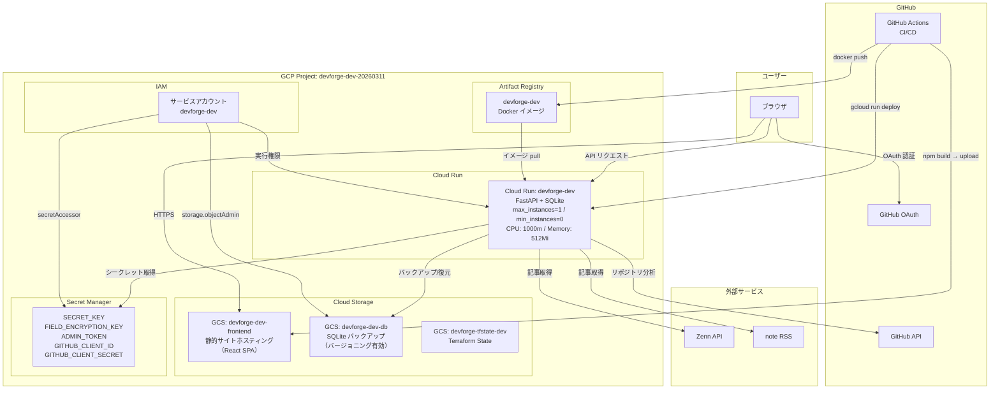

# DevForge

キャリア関連ドキュメント（職務経歴書・履歴書）の作成・管理に加え、GitHub活動分析やブログ連携によるキャリアインテリジェンスを提供するWebアプリケーションです。

## 主な機能

### ドキュメント管理
- **基本情報**: 氏名・記載日・資格の管理
- **職務経歴書**: 職務要約、自己PR、職務経歴、技術スタックの入力とPDF/Markdown出力
- **履歴書**: 学歴・職歴・志望動機・証明写真等の入力とPDF/Markdown出力（個人情報フィールドは暗号化保存）

### GitHub分析
- GitHub OAuthログインしたユーザーのリポジトリ・コミット履歴を自動分析
- スキル抽出・タイムライン可視化・成長分析・キャリア予測
- Ollama（ローカルLLM）による分析結果のAI要約（オプション）

### ブログ連携
- **Zenn** / **note** のアカウント連携・記事同期
- 記事メトリクス（タイトル、URL、公開日、いいね数、タグ）の一覧管理
- Ollama によるブログ活動のAI要約（オプション）

## 技術スタック

| レイヤー | 技術 |
|---|---|
| フロントエンド | React 18, TypeScript, Vite, Recharts |
| バックエンドAPI | Python 3.12, FastAPI, SQLAlchemy, Pydantic |
| データベース | SQLite（GCSバックアップ） |
| 認証 | JWT (python-jose), bcrypt, GitHub OAuth |
| 暗号化 | Fernet（フィールド暗号化）, bcrypt（パスワード） |
| PDF出力 | ReportLab |
| LLM | Ollama（ローカル、オプション） |
| インフラ | GCP (Cloud Run, GCS, Artifact Registry, Secret Manager) |
| IaC | Terraform（モジュール構成、マルチ環境） |
| CI/CD | GitHub Actions |

## クイックスタート

### 1. バックエンド起動

```bash
cd backend
python3 -m venv .venv
source .venv/bin/activate
pip install -r requirements.txt
cp .env.example .env
python -m app.bootstrap
uvicorn app.main:app --reload --host 0.0.0.0 --port 8000
```

`SQLITE_DB_PATH=./local.sqlite` でローカル永続ファイルを使います。

### 2. フロントエンド起動

別ターミナルで:

```bash
cd frontend
cp .env.example .env
npm install
npm run dev
```

ブラウザで `http://localhost:5173` を開きます。

### 3. Docker起動（FastAPI + Ollama）

```bash
docker compose up --build
```

Ollama（LLM）も同時に起動します。GitHub分析やブログのAI要約機能を使う場合はDocker起動を推奨します。

#### マスタデータ変更時の再起動

シードデータ（`backend/app/seed.py`）を変更した場合:

```bash
docker compose build --no-cache
rm data/devforge.sqlite
docker compose up
```

## DBクライアント（DBeaver等）からSQLiteに接続する

Docker起動時、SQLiteファイルはホストの `./data/devforge.sqlite` にバインドマウントされます。

1. `docker compose up --build` でコンテナを起動する
2. DBeaver で **新規接続** → **SQLite** を選択
3. **Path** に `<プロジェクトルート>/data/devforge.sqlite` を指定
4. **テスト接続** → **完了**

> **注意**: SQLite はファイルロックで排他制御するため、DBeaver で書き込みを行うとアプリ側と競合する場合があります。参照のみの利用を推奨します。

## API概要

### 認証
- `POST /auth/register`: 新規ユーザー登録（username, email, password）
- `POST /auth/login`: ログイン
- `POST /auth/logout`: ログアウト
- `POST /auth/github/callback`: GitHub OAuth コールバック

### 基本情報
- `POST /api/basic-info`: 作成
- `PUT /api/basic-info/{id}`: 更新
- `GET /api/basic-info/latest`: 最新データ取得

### 職務経歴書
- `POST /api/resumes`: 作成
- `PUT /api/resumes/{id}`: 更新
- `GET /api/resumes/latest`: 最新データ取得
- `GET /api/resumes/{id}`: 取得
- `GET /api/resumes/{id}/pdf`: PDFダウンロード
- `GET /api/resumes/{id}/markdown`: Markdownダウンロード

### 履歴書
- `POST /api/rirekisho`: 作成
- `PUT /api/rirekisho/{id}`: 更新
- `GET /api/rirekisho/latest`: 最新データ取得
- `GET /api/rirekisho/{id}`: 取得
- `GET /api/rirekisho/{id}/pdf`: PDFダウンロード
- `GET /api/rirekisho/{id}/markdown`: Markdownダウンロード

### GitHub分析
- `POST /api/intelligence/analyze`: GitHub活動の全パイプライン分析（GitHub OAuth必須）
- `POST /api/intelligence/skill-activity`: コミットアクティビティタイムライン取得
- `POST /api/intelligence/summarize`: Ollama によるAI要約（オプション）

### ブログ連携
- `GET /api/blog/accounts`: 連携アカウント一覧
- `POST /api/blog/accounts`: アカウント追加（Zenn / note）
- `DELETE /api/blog/accounts/{id}`: アカウント削除
- `GET /api/blog/articles`: 記事一覧（プラットフォームでフィルタ可）
- `POST /api/blog/accounts/{id}/sync`: 外部プラットフォームから記事同期
- `POST /api/blog/summarize`: Ollama によるブログAI要約（オプション）

### マスタデータ管理
- `GET /api/master-data/qualification`: 資格一覧
- `POST /api/master-data/qualification`: 資格追加（管理者）
- `PUT /api/master-data/qualification/{id}`: 資格更新（管理者）
- `DELETE /api/master-data/qualification/{id}`: 資格削除（管理者）
- `GET /api/master-data/prefecture`: 都道府県一覧
- `POST /api/master-data/technology-stack`: 技術スタック追加（管理者）

### 管理
- `POST /admin/backup`: SQLite DBをGCSへバックアップ（Bearerトークン必須）

### その他
- `GET /health`: ヘルスチェック

## 環境変数

各 `.env.example` を参照。主要な設定:

| 変数 | 用途 |
|---|---|
| `SQLITE_DB_PATH` | SQLiteファイルパス（例: `/tmp/devforge.sqlite`） |
| `SECRET_KEY` | JWT署名キー |
| `FIELD_ENCRYPTION_KEY` | Fernet暗号化キー |
| `GCS_BUCKET_NAME` / `GCS_DB_OBJECT` | GCSバックアップ先（未設定ならスキップ） |
| `CORS_ORIGINS` | 許可するオリジン（カンマ区切り） |
| `GITHUB_CLIENT_ID` / `GITHUB_CLIENT_SECRET` | GitHub OAuth（任意） |
| `OLLAMA_BASE_URL` | Ollama エンドポイント（デフォルト: `http://localhost:11434`） |
| `VITE_API_BASE_URL` | フロントエンド→バックエンドURL（デフォルト: `http://localhost:8000`） |

## SQLite + GCSバックアップ/復元

- **起動時**: GCS→ローカル復元 → Alembic `upgrade head` → アプリ起動（復元失敗時は空DBで起動）
- **バックアップ**: `POST /admin/backup` または `python -m app.backup`
- **Cloud Run IAM**: `storage.objects.{get,create,list}`

## Alembicマイグレーション

```bash
cd backend && alembic upgrade head
```

設定: `backend/alembic.ini` / `backend/alembic_migrations/versions`
SQLiteはDDL制約があるため、複雑なALTERはテーブル再作成型マイグレーションを推奨。

## テスト

### フロントエンド
```bash
cd frontend
npm run test
```

### バックエンド
```bash
cd backend
.venv/bin/python -m pytest -q
```

## CI (GitHub Actions)
- ワークフロー: `.github/workflows/ci.yml`
- 実行タイミング:
  - `pull_request` (target: `dev` / `stg` / `main`)
  - `push` (`dev` / `stg` / `main`)
- 実行内容:
  - `frontend/**` / `backend/**` / `.github/workflows/ci.yml` に変更がある場合:
    - frontend: `npm run test`, `npm run build`
    - backend: `python -m pytest -q tests` (working-directory: `backend`)
  - 上記以外の変更のみの場合:
    - `test` ジョブは軽量な no-op で成功を返す
- 低コスト運用の工夫:
  - Linuxランナーのみ使用
  - Node/Python依存キャッシュを利用
  - アプリ差分がない場合は重い処理をスキップ
  - `concurrency` で古い実行を自動キャンセル
  - `dev` への `push` のみ CD を実行

### アプリケーションCI（`.github/workflows/ci.yml`）
- **実行タイミング**: `pull_request` / `push`（target: `main` / `dev`、`frontend/**` or `backend/**` 変更時）
- **テスト**: frontend（lint, test, build）+ backend（flake8, pytest）
- **自動デプロイ**（`dev` ブランチ push 時のみ）:
  - フロントエンド → GCSバケットへアップロード
  - バックエンド → Artifact Registry へイメージ push → Cloud Run デプロイ
- **低コスト運用**: Linuxランナー、依存キャッシュ、`concurrency` で古い実行を自動キャンセル

## インフラストラクチャ

### Terraform (GCS backend)
- テンプレート配置: `infra/`
- 構成: `infra/environments/dev|stg|prod`, `infra/modules/`
- モジュール: `service_account`, `artifact_registry`, `storage`, `cloud_run`
- バージョン管理: 各環境の `versions.tf` / `terraform.tfvars`

### 初期設定
```bash
# 1. GCS tfstateバケットを作成
gcloud storage buckets create gs://devforge-tfstate-dev \
  --location=asia-northeast1 --uniform-bucket-level-access

# 2. インフラ構築
cd infra/environments/dev
terraform init && terraform plan && terraform apply
```

### システム構成図（dev環境）



## main ブランチ保護

### Terraform検証CI
- ワークフロー: `.github/workflows/terraform-ci.yml`
- 実行タイミング:
  - `pull_request` (target: `dev` / `stg` / `main`)
  - `push` (`dev` / `stg` / `main`)
- 実行内容:
  - `infra/**` または `.github/workflows/terraform-ci.yml` に変更がある場合:
    - `terraform fmt -check -recursive`
    - `terraform init -backend=false`
    - `terraform validate`
  - 上記以外の変更のみの場合:
    - Terraform ジョブは軽量な no-op で成功を返す

## protected branches
### ローカル（ターミナル）での直コミット/直push防止
```bash
./scripts/setup-git-hooks.sh
```

- `.githooks/pre-commit`: `dev` / `stg` / `main` への直接コミットを拒否
- `.githooks/pre-push`: `dev` / `stg` / `main` への直接pushを拒否

### GitHub 側での強制保護（推奨）
1. GitHub リポジトリの `Settings` -> `Branches` -> `Add branch protection rule`
2. `Branch name pattern` に `dev` を設定
3. 以下を有効化
   - `Require a pull request before merging`
   - `Require status checks to pass before merging`
     - `test`
     - `terraform-fmt`
     - `terraform-validate-dev`
     - `terraform-validate-stg`
     - `terraform-validate-prod`
4. `stg` と `main` についても同じ設定を追加
5. `Do not allow bypassing the above settings`（利用可能な場合）を有効化
6. 保存

---

## GCP デプロイ手順（dev 環境）

### 1. 事前準備

```bash
# gcloud 認証
gcloud auth login
gcloud config set project devforge-dev-20260311

# 必要な GCP API を有効化
gcloud services enable artifactregistry.googleapis.com
gcloud services enable run.googleapis.com
```

### 2. Terraform でインフラを構築する

上記「[Terraform (GCS backend) > 初期設定](#初期設定)」を参照。

### 3. Docker イメージをビルドして push する

> **注意**: Apple Silicon Mac（M1/M2/M3）は必ず `--platform linux/amd64` を付けること。
> 省略すると Cloud Run で `exec format error` が発生する。

```bash
# Docker → Artifact Registry の認証設定（初回のみ）
gcloud auth configure-docker asia-northeast1-docker.pkg.dev

# ビルド → タグ付け → push
docker build --platform linux/amd64 -t devforge-dev ./backend
docker tag devforge-dev asia-northeast1-docker.pkg.dev/devforge-dev-20260311/devforge-dev/devforge-dev:latest
docker push asia-northeast1-docker.pkg.dev/devforge-dev-20260311/devforge-dev/devforge-dev:latest
```

### 4. Cloud Run にデプロイする

```bash
gcloud run deploy devforge-dev \
  --image asia-northeast1-docker.pkg.dev/devforge-dev-20260311/devforge-dev/devforge-dev:latest \
  --region asia-northeast1 \
  --platform managed

# デプロイ確認（URL取得）
gcloud run services describe devforge-dev --region asia-northeast1 \
  --format "value(status.url)"
```

### 5. トラブルシューティング

| エラー | 原因 | 対処 |
|---|---|---|
| `Error 403: ... is disabled` | GCP API が未有効 | `gcloud services enable <API名>` |
| `exec format error` | Apple Silicon で `--platform linux/amd64` が未指定 | 上記手順3でビルドし直す |
| `deletion protection is enabled` | Terraform destroy 時 | リソースの `deletion_protection = false` に変更 → `apply` → `destroy` |

---

秘密情報（`ADMIN_TOKEN` 等）は Secret Manager 経由の環境変数注入を推奨。
